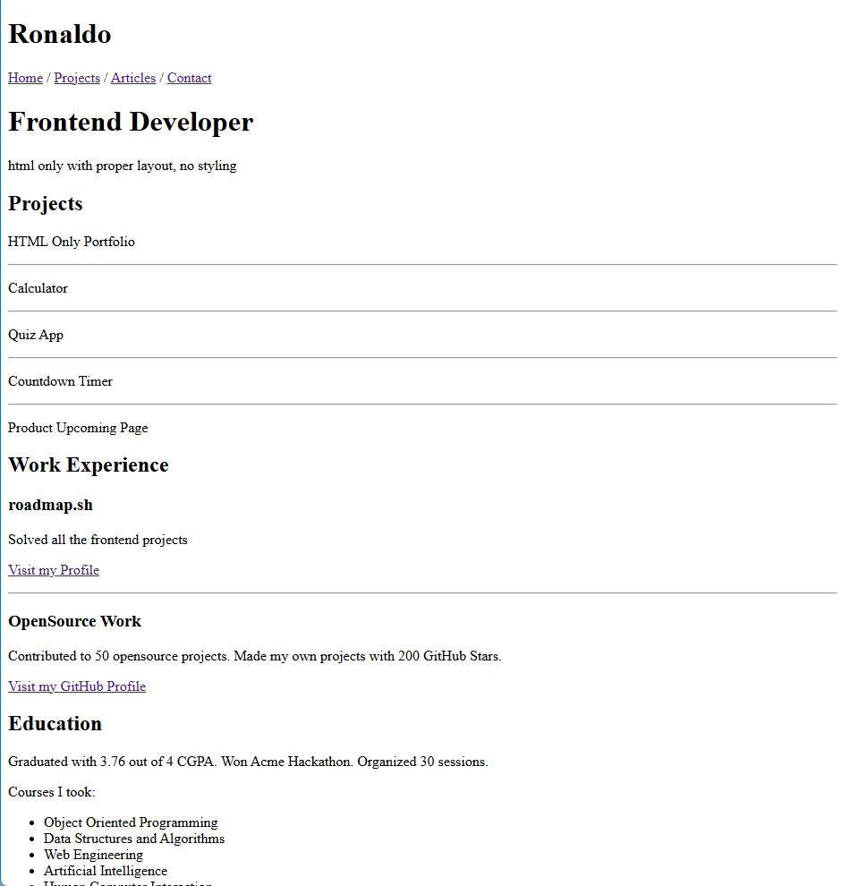

# basic-html-website
Structured basic HTML website using HTML i.e. different sections of a website like header, footer, navigation, main content, sidebars, etc.

# Key Aspects
- Semantically correct HTML structure
- Multiple pages with a navigation bar
- SEO meta tags in the head of each page
- The contact page should have a form with fields like name, email, message etc.

Full details of the project is linked here: [Basic HTML Website](https://roadmap.sh/projects/basic-html-website)

# Screenshot of completed project

Live demo is here if interested! [Project Demo](https://ronnierods.github.io/basic-html-website/)
